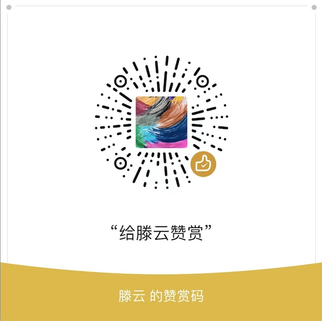

## 项目信息
- **码如云**是一个基于二维码的一物一码管理平台，可用于固定资产管理，设备巡检和问卷调查等众多场景。在技术上，码如云是一个无代码平台，全程采用DDD、事件驱动架构和整洁架构思想完成开发。
- 本项目为码如云的前端应用，包含电脑端(console)和手机端(client)
- 与本项目配套的码如云后端代码请访问：[https://github.com/mryqr-com/mry-backend](https://github.com/mryqr-com/mry-backend)

## 在线免费使用
- 您可以访问[https://www.mryqr.com](https://www.mryqr.com)免费使用码如云在线服务
- 我们正在寻找能够提供微信公众号（需要是**服务号**类型）的合作方，以让码如云能够入驻在该公众号中，从而为用户提供更多更完善的功能，有意者可联系作者


## 本地环境搭建
- 安装 Node.js（可工作版本v14.18.1，其他版本未试过）
- 运行 `npm install` 安装依赖
- 将以下内容加入 `/etc/hosts` 文件，本地访问时需要使用域名访问
  ```
  127.0.0.1       console.local.mryqr.com
  127.0.0.1       m.local.mryqr.com
  127.0.0.1       api.local.mryqr.com
  0.0.0.0         console.local.mryqr.com
  0.0.0.0         m.local.mryqr.com
  0.0.0.0         api.local.mryqr.com
  ```
- 本地运行: `./local-run.sh`
- 访问电脑端：http://console.local.mryqr.com
- 访问手机端：http://m.local.mryqr.com
- 本地构建: `./ci-build.sh`

## 技术栈

Vue 2, Webpack 4, Axios 0.24, Element UI 2等


## 修改ElementUI主题
- 根据需要修改 `element-variables.scss` 文件
- 运行 `./customize-element.sh`


## 赞赏作者

如果您认为本代码库能为您带去用处与价值，您可微信扫描以下二维码赞赏作者，以请作者喝杯咖啡。



